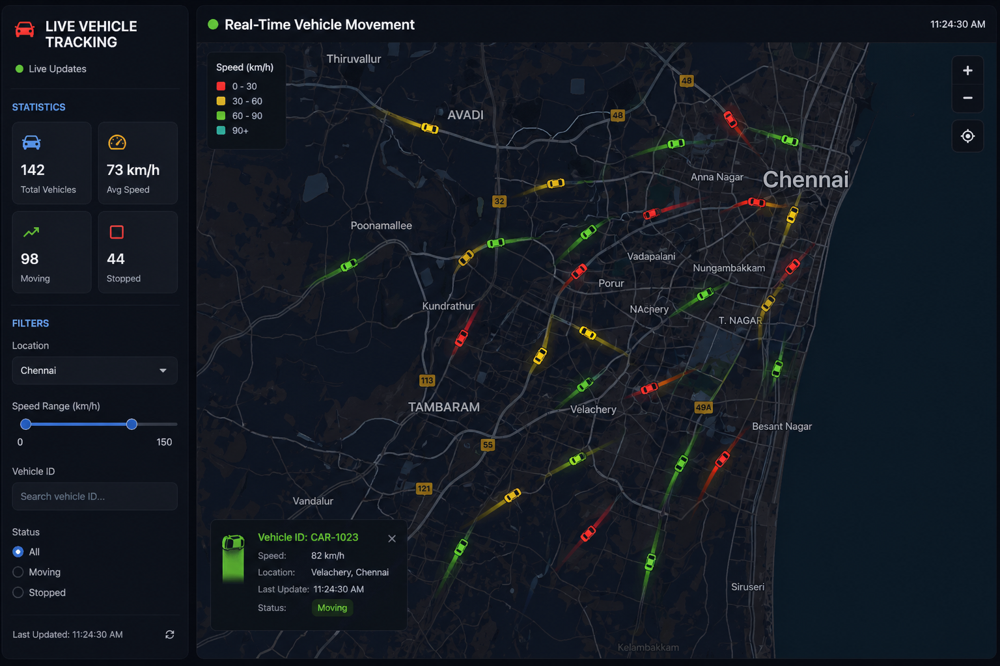
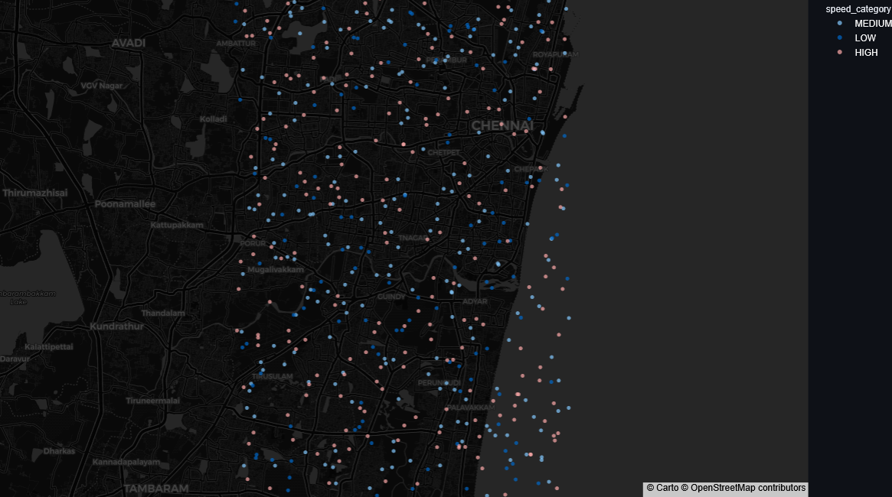
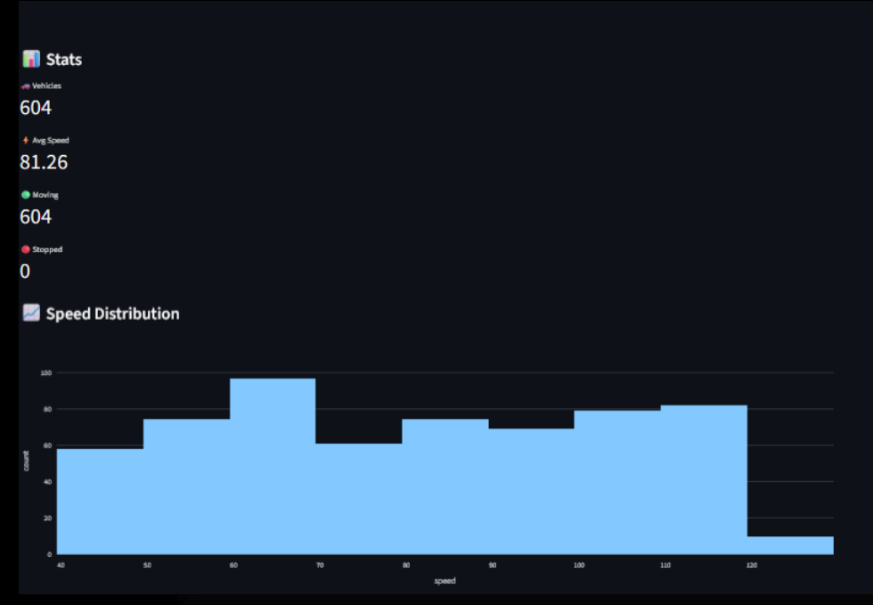

# 🚗 Real-Time Vehicle Movement Tracking Dashboard

A real-time vehicle tracking and analytics system built using **Apache Kafka**, **Python**, **MongoDB**, and **Streamlit**.

This project simulates live vehicle movement data, streams it through Kafka, stores it in MongoDB, and visualizes moving vehicles on an interactive live map dashboard similar to Uber/Zomato tracking systems.

---

# 📌 Features

✅ Real-time vehicle data streaming using Apache Kafka  
✅ Live vehicle tracking dashboard  
✅ Interactive dark-themed map visualization  
✅ Vehicle movement simulation  
✅ Speed-based analytics  
✅ MongoDB integration for data storage  
✅ Real-time statistics panel  
✅ Kafka Producer & Consumer architecture  
✅ Streamlit-based UI dashboard  

---

# 🛠️ Tech Stack

- Python
- Apache Kafka
- Zookeeper
- MongoDB
- Streamlit
- Plotly
- Pandas
- PyMongo

---

# 📷 Project Screenshots

## 🔥 Uber-Style Vehicle Tracking Dashboard



---

## 📍 Live Vehicle Map Visualization



---

## 📊 Analytics Dashboard



---

# 📂 Project Structure

```bash
kafka_project/
│
├── producer.py
├── consumer.py
├── dashboard.py
├── mongo_db.py
├── requirements.txt
├── README.md
│
├── analytics.png
├── mapvisual.png
└── Real-time_vehicleMovement_dashboard.png
```

---

# ⚙️ Installation & Setup

## 1️⃣ Clone Repository

```bash
git clone https://github.com/yourusername/real-time-vehicle-tracking.git
cd real-time-vehicle-tracking
```

---

## 2️⃣ Install Dependencies

```bash
pip install -r requirements.txt
```

---

# 🚀 Running the Project

## Step 1 — Start Zookeeper

```bash
.\bin\windows\zookeeper-server-start.bat .\config\zookeeper.properties
```

---

## Step 2 — Start Kafka Server

```bash
.\bin\windows\kafka-server-start.bat .\config\server.properties
```

---

## Step 3 — Start MongoDB

```bash
net start MongoDB
```

---

## Step 4 — Run Kafka Producer

```bash
python producer.py
```

---

## Step 5 — Run Kafka Consumer

```bash
python consumer.py
```

---

## Step 6 — Run Streamlit Dashboard

```bash
python -m streamlit run dashboard.py
```

---

# 📊 Dashboard Capabilities

- Live moving vehicle visualization
- Speed tracking
- Moving vs stopped vehicles
- Average speed monitoring
- Real-time updates
- Interactive zoomable maps

---

# 🔥 Future Improvements

- AI-based traffic prediction
- Route optimization
- Driver behavior analytics
- GPS integration
- Docker deployment
- Spark Streaming integration
- Cloud deployment (AWS/GCP)

---

# 👩‍💻 Author

### Sagufta Perween

- GitHub: https://github.com/saguftaperween
- LinkedIn: https://www.linkedin.com/in/sagufta-perween-94948424a/

---

# ⭐ If you liked this project

Give this repository a ⭐ on GitHub.